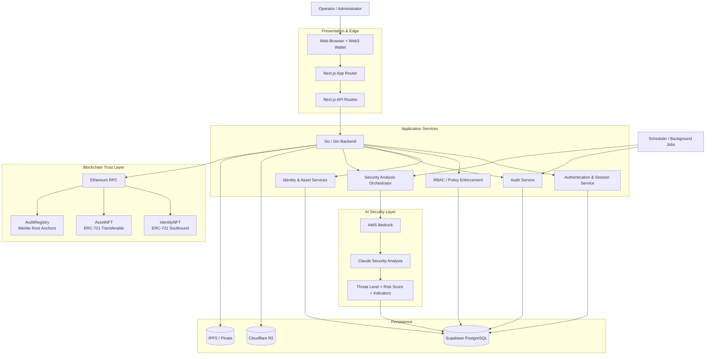
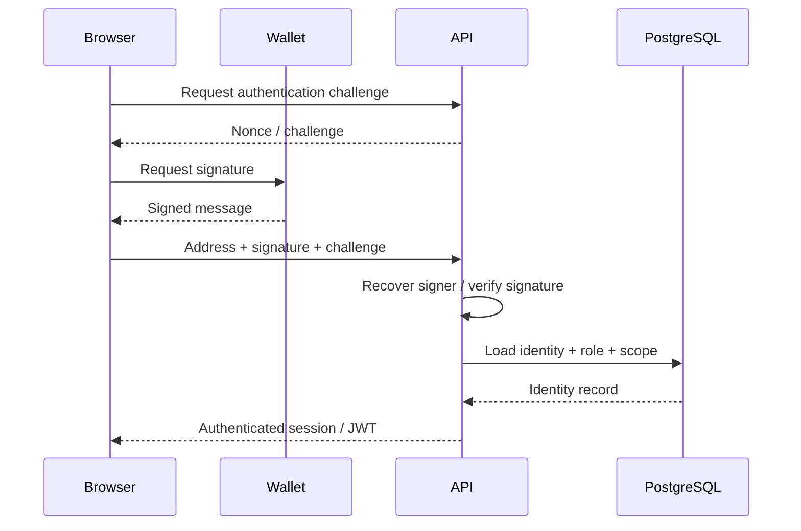
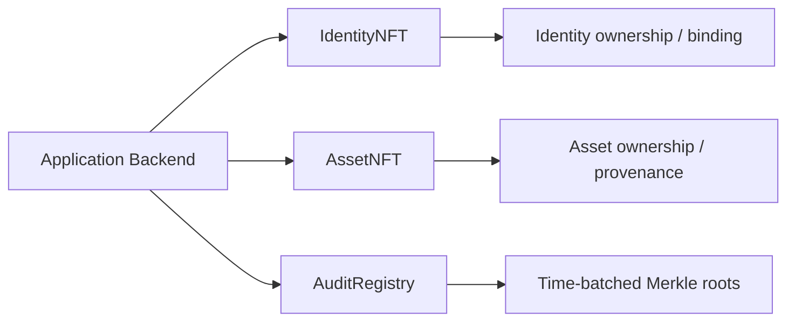
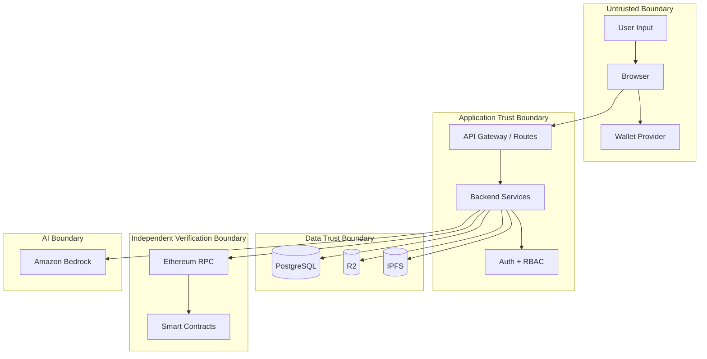
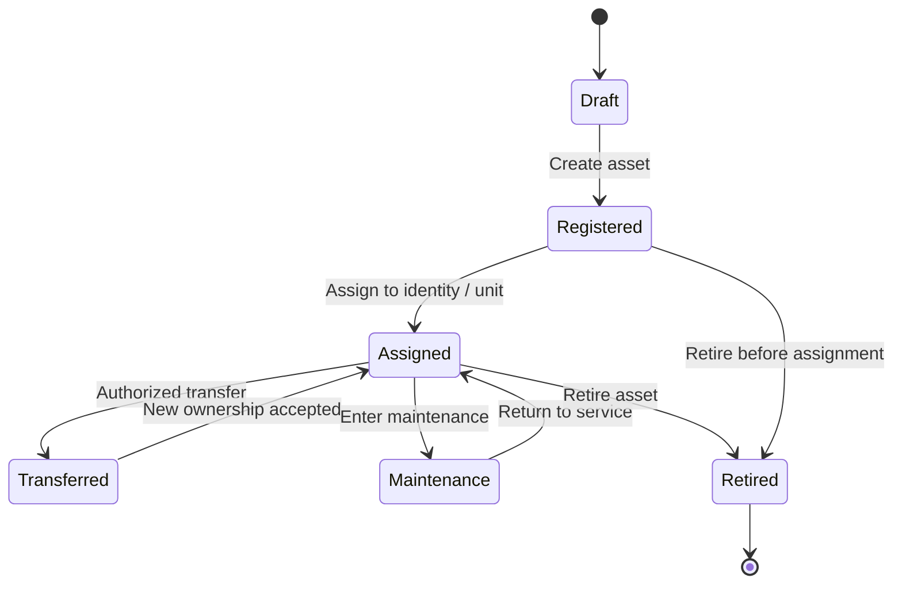

# BEL Secure Platform

> **Blockchain-Anchored Identity, Asset Management & Zero-Trust Security Platform**
>
> A security-first platform designed for defense and government operations, combining self-custodial wallet authentication, decentralized identity, on-chain asset provenance, cryptographic audit anchoring, and AI-assisted threat analysis.

**Smart India Hackathon 2024 — Problem Statement:** `SIH1663` — *Blockchain-Based Identity & Asset Management for National Security Applications*

[](https://soliditylang.org/)
[](https://nextjs.org/)
[](https://www.typescriptlang.org/)
[](https://gin-gonic.com/)
[](https://supabase.com/)
[](https://ethereum.org/)
[](https://aws.amazon.com/bedrock/)
[](LICENSE)

**Live application:** https://bel-seven.vercel.app/

**Repository:** https://github.com/Prajjwaldevops/BEland

---

## Table of Contents

- [1. Overview](#1-overview)
- [2. Problem](#2-problem)
- [3. Solution](#3-solution)
- [4. Core Design Principles](#4-core-design-principles)
- [5. Architecture at a Glance](#5-architecture-at-a-glance)
- [6. Detailed Architecture](#6-detailed-architecture)
  - [6.1 Presentation Layer](#61-presentation-layer)
  - [6.2 API and Application Layer](#62-api-and-application-layer)
  - [6.3 Identity and Authentication Layer](#63-identity-and-authentication-layer)
  - [6.4 Data Layer](#64-data-layer)
  - [6.5 Blockchain Layer](#65-blockchain-layer)
  - [6.6 Object and Decentralized Storage](#66-object-and-decentralized-storage)
  - [6.7 AI Security Layer](#67-ai-security-layer)
  - [6.8 Audit and Scheduling Pipeline](#68-audit-and-scheduling-pipeline)
- [7. Trust Boundaries](#7-trust-boundaries)
- [8. End-to-End Data Flows](#8-end-to-end-data-flows)
- [9. Smart Contract Architecture](#9-smart-contract-architecture)
- [10. Identity Model](#10-identity-model)
- [11. Asset Lifecycle](#11-asset-lifecycle)
- [12. Auditability and Merkle Anchoring](#12-auditability-and-merkle-anchoring)
- [13. Zero-Trust Access Model](#13-zero-trust-access-model)
- [14. AI Threat Detection](#14-ai-threat-detection)
- [15. Cryptography](#15-cryptography)
- [16. Storage Strategy](#16-storage-strategy)
- [17. Roles and Authorization](#17-roles-and-authorization)
- [18. Security Guarantees](#18-security-guarantees)
- [19. Project Structure](#19-project-structure)
- [20. Local Development](#20-local-development)
- [21. Environment Variables](#21-environment-variables)
- [22. Deployment](#22-deployment)
- [23. Testing](#23-testing)
- [24. Operational Considerations](#24-operational-considerations)
- [25. Current Status and Limitations](#25-current-status-and-limitations)
- [26. Roadmap](#26-roadmap)
- [27. Contributing](#27-contributing)
- [28. License](#28-license)

---

## 1. Overview

BEL Secure Platform is an architecture for managing **people, identities, assets, permissions, documents, and security events** in environments where traceability and controlled access are critical.

The platform separates data by its security and trust requirements rather than forcing everything into one database or one blockchain transaction. The result is a hybrid architecture:

- **Next.js** provides the web application and operator experience.
- **Go + Gin and Next.js API routes** provide application APIs and security-sensitive orchestration.
- **Supabase/PostgreSQL** stores operational state and queryable application data.
- **Ethereum/Sepolia smart contracts** act as a tamper-evident trust anchor for identity, asset ownership/provenance, and audit roots.
- **Cloudflare R2** is used for large/private object storage such as photographs.
- **IPFS/Pinata** is used for content-addressed documents/metadata where decentralized retrieval is useful.
- **AWS Bedrock + Claude** provides AI-assisted analysis of aggregated authentication, access, and transaction activity.

The key architectural idea is simple:

> **Keep large and frequently changing operational data off-chain, while anchoring critical proofs and state transitions on-chain.**

This avoids using the blockchain as a general-purpose database while preserving an independently verifiable integrity layer.

---

## 2. Problem

Conventional identity and asset-management systems often concentrate authority and audit evidence in centrally controlled infrastructure. That creates several challenges for sensitive environments:

1. **Identity records can become dependent on a single administrative database.**
2. **Asset provenance may be fragmented across departments and systems.**
3. **Audit logs can be altered, deleted, or rewritten by privileged administrators if no independent integrity anchor exists.**
4. **Access decisions may rely too heavily on static roles instead of continuously evaluating context.**
5. **Security teams may have large volumes of logs but limited automated correlation of suspicious behavior.**

BEL addresses these concerns by introducing a verifiable identity layer, blockchain-backed provenance, cryptographic audit anchoring, role-aware access control, and AI-assisted anomaly analysis.

---

## 3. Solution

BEL models the platform as a set of cooperating security domains:

```text
                         ┌──────────────────────┐
                         │      Operator         │
                         │   Browser / Wallet    │
                         └──────────┬───────────┘
                                    │
                              HTTPS / Signature
                                    │
                                    ▼
                    ┌─────────────────────────────┐
                    │    Next.js Application      │
                    │ UI + API Routes + Sessions  │
                    └──────────────┬──────────────┘
                                   │
                         Authenticated requests
                                   │
                                   ▼
                    ┌─────────────────────────────┐
                    │     Go / Gin Backend        │
                    │ Validation + RBAC + Flows   │
                    └───────┬────────┬────────────┘
                            │        │
                  ┌─────────┘        └─────────┐
                  ▼                            ▼
         ┌─────────────────┐          ┌─────────────────┐
         │ PostgreSQL      │          │ Blockchain RPC  │
         │ Operational DB  │          │ Ethereum        │
         └─────────────────┘          └────────┬────────┘
                                               │
                              ┌────────────────┼────────────────┐
                              ▼                ▼                ▼
                       IdentityNFT          AssetNFT      AuditRegistry
                       Soulbound ID        Provenance      Merkle Root

        Files / Documents ──► R2 / IPFS ──► Content Hash / CID ──► Anchor

        Security Events ──► Aggregation ──► Bedrock/Claude ──► Risk + Indicators
```

The system therefore has **two complementary trust models**:

- **Application trust:** authenticated users, authorization middleware, database state, and storage controls.
- **Cryptographic trust:** signed wallet actions, contract state, content hashes, and Merkle-root anchoring.

---

## 4. Core Design Principles

### 4.1 Zero-trust by default

Every protected operation is treated as a new authorization decision. A previously authenticated session does not automatically imply permission for every resource.

### 4.2 Least privilege

Roles are scoped to the operations and organizational boundaries they need. Department-level users should not receive cross-department privileges by default.

### 4.3 Off-chain for volume, on-chain for proof

Photos, documents, analytics, and high-volume operational records remain off-chain. Blockchain stores the minimal state and cryptographic anchors needed for independent verification.

### 4.4 Verifiable state transitions

Operations that modify trusted identity or asset state are linked to cryptographic signatures and/or smart-contract transactions rather than relying solely on a mutable database row.

### 4.5 Defense in depth

Security controls are intentionally layered: wallet authentication, session controls, role checks, rate limiting, smart-contract authorization, integrity checks, secure storage, and behavioral analysis.

### 4.6 Separation of concerns

The frontend, business logic, data persistence, blockchain integration, storage, and security analysis are independently replaceable components.

---

## 5. Architecture at a Glance



### Architectural responsibility map

| Layer | Primary responsibility | Main technologies |
|---|---|---|
| Client | UI, operator workflows, wallet interaction | Next.js, React, TypeScript, Tailwind, Framer Motion |
| API | HTTP boundary, request handling, server-side orchestration | Next.js API routes, Go/Gin |
| Auth | Wallet-signature verification and session management | EIP-191/EIP-712, JWT |
| Authorization | Role and scope enforcement | On-chain roles + backend middleware |
| Operational DB | Queryable system state | PostgreSQL / Supabase |
| Blockchain | Verifiable state and integrity anchors | Solidity, OpenZeppelin, Ethereum Sepolia |
| Object storage | Large/private binary objects | Cloudflare R2 |
| Content-addressed storage | Decentralized documents/metadata | IPFS / Pinata |
| Security intelligence | Behavioral analysis and reporting | AWS Bedrock / Claude |
| Scheduling | Periodic aggregation and anchoring | node-cron / background jobs |

---

## 6. Detailed Architecture

### 6.1 Presentation Layer

The presentation layer is built with **Next.js** and TypeScript.

Responsibilities include:

- Operator dashboard and system views.
- Authentication UX and wallet connection.
- Identity registration and identity-detail views.
- Asset creation, assignment, transfer, and provenance views.
- Audit-log exploration and verification UX.
- Security alerts and AI-generated incident summaries.
- Client-side interaction with wallet providers.

The browser is deliberately **not** treated as a trusted execution environment. Sensitive secrets such as database service-role keys, private RPC credentials, AWS secret keys, and contract deployment keys must never be exposed to the client.

---

### 6.2 API and Application Layer

The application layer coordinates requests across authentication, business rules, persistence, external storage, and blockchain transactions.

A typical request moves through the following sequence:

```text
HTTP Request
    │
    ▼
Route / Handler
    │
    ▼
Input Validation
    │
    ▼
Session / Wallet Verification
    │
    ▼
RBAC + Department Scope Check
    │
    ▼
Business Service
    │
    ├────────► PostgreSQL
    │
    ├────────► R2 / IPFS
    │
    └────────► Blockchain RPC
    │
    ▼
Audit Event
    │
    ▼
Response
```

The Go/Gin service is useful for security-sensitive and backend-heavy operations because it separates long-running application logic and external integration concerns from the browser UI.

Next.js API routes can act as the web-facing API boundary where close integration with the application/session model is useful.

---

### 6.3 Identity and Authentication Layer

BEL uses a **self-custodial wallet model** rather than a conventional username/password-only flow.

#### Authentication sequence



The security properties of this approach include:

- Private keys remain under user/wallet control.
- The backend can verify that the wallet authorized the request.
- State-changing actions can use typed EIP-712 signatures.
- The blockchain address becomes a cryptographic identifier rather than a mutable username.

A production implementation should additionally enforce nonce expiry, replay protection, domain separation, chain binding, signature freshness, session expiry, and wallet-address-to-identity consistency.

---

### 6.4 Data Layer

**Supabase PostgreSQL** is the operational source for structured application data.

Typical responsibilities include:

- User and identity metadata.
- Department and role mappings.
- Asset references.
- Audit-event indexing.
- Document metadata and content identifiers.
- Security events and threat-analysis results.
- Session-related data where applicable.

The database is optimized for:

- Fast querying.
- Filtering by department/user/asset.
- Aggregation over security events.
- Application-level transactional workflows.

The blockchain is intentionally not used for every database record because storing large, frequently changing datasets directly on a public chain would increase cost, latency, and operational complexity.

---

### 6.5 Blockchain Layer

The blockchain layer provides a public, independently verifiable trust anchor.

The architecture separates responsibilities into three conceptual contracts:



#### IdentityNFT

- ERC-721-based identity token.
- Intended to be **soulbound / non-transferable**.
- Represents the blockchain anchor for an identity.
- Associates identity state with a wallet-controlled address.

#### AssetNFT

- ERC-721-based transferable asset representation.
- Used to model ownership/provenance of managed assets.
- Asset metadata can reference off-chain content while integrity hashes are anchored on-chain.

#### AuditRegistry

- Stores cryptographic commitments such as Merkle roots.
- Provides a compact on-chain proof that a set of off-chain events existed in a specific committed state.
- Allows later proof verification without storing every raw audit record on-chain.

---

### 6.6 Object and Decentralized Storage

The architecture uses different storage systems for different data characteristics.

| Data | Storage | Why |
|---|---|---|
| Structured application records | PostgreSQL | Queryable, relational, transactional |
| Photos / large private files | Cloudflare R2 | Low-cost object storage and delivery |
| Documents / content-addressed artifacts | IPFS / Pinata | Content addressing and decentralized retrieval |
| Critical integrity proof | Ethereum | Independent tamper-evident anchor |

The recommended pattern is:

```text
Binary / Document
      │
      ├──► Store object
      │       │
      │       └──► Receive object URL or CID
      │
      ├──► Calculate cryptographic hash
      │
      ├──► Persist metadata in PostgreSQL
      │
      └──► Anchor hash / commitment on-chain
```

This means the chain does not need to contain the actual document. It only needs the proof required to detect unauthorized modification.

---

### 6.7 AI Security Layer

The platform describes an integration with **AWS Bedrock and Anthropic Claude** for security analytics.

The AI component should be viewed as an **analysis and decision-support layer**, not as the root of authorization.

Inputs can include aggregated signals such as:

- Recent login attempts.
- Authentication failures.
- IP/location changes.
- Device changes.
- Access time anomalies.
- Bulk downloads.
- Unusual transaction volume.
- Privilege or scope changes.
- Cross-department access patterns.

A conceptual pipeline is:

```text
Raw Events
   │
   ▼
Normalization / Aggregation
   │
   ▼
Feature Construction
   │
   ├── Login features
   ├── Device features
   ├── Location features
   ├── Transaction features
   └── Access-scope features
   │
   ▼
AWS Bedrock / Claude
   │
   ▼
Structured Security Result
   │
   ├── Threat level
   ├── Confidence
   ├── Indicators
   ├── Context
   └── Mitigation suggestions
   │
   ▼
Store + Surface to Security Operator
```

The application should continue to enforce authorization deterministically. AI analysis can raise alerts, enrich incidents, or recommend investigation steps, but it should not silently bypass hard access-control rules.

---

### 6.8 Audit and Scheduling Pipeline

High-volume events are collected off-chain and periodically committed using cryptographic batching.

```text
Event A ─┐
Event B ─┼─► Leaf Hashes ─► Merkle Tree ─► Merkle Root ─► Blockchain
Event C ─┤
Event D ─┘

                           │
                           └──► PostgreSQL keeps raw event records
```

A scheduler can periodically:

1. Collect events that have not yet been anchored.
2. Canonicalize the event representation.
3. Hash each event.
4. Build a Merkle tree.
5. Publish the Merkle root to `AuditRegistry`.
6. Store the root, batch range, timestamp, and transaction hash in PostgreSQL.
7. Mark the corresponding events as anchored.

The result is a scalable compromise between full on-chain logging and mutable-only centralized logs.

---

## 7. Trust Boundaries



Important boundary assumptions:

- The browser can be modified by an attacker.
- The wallet provider is an external dependency and must be treated as a signing interface.
- PostgreSQL is trusted for operational correctness but is not the independent integrity root.
- Object storage is trusted for availability, while hashes provide integrity verification.
- IPFS provides content addressing but does not automatically solve authorization or confidentiality.
- The blockchain provides public verification, but contract security and key management remain critical.
- AI outputs are advisory and require deterministic application controls around them.

---

## 8. End-to-End Data Flows

### 8.1 Wallet authentication

```text
User
 │
 ▼
Connect Wallet
 │
 ▼
Request Challenge
 │
 ▼
Sign Challenge
 │
 ▼
Backend Verifies Signature
 │
 ├──► Resolve wallet → identity
 ├──► Resolve role
 └──► Resolve department scope
 │
 ▼
Issue Session / JWT
 │
 ▼
Authenticated Dashboard
```

### 8.2 Identity registration

```text
Administrator
    │
    ▼
Submit identity details
    │
    ▼
Validate + authorize
    │
    ├────► Store operational metadata
    │
    ├────► Store photo/document references
    │
    ├────► Compute integrity hashes
    │
    └────► Mint IdentityNFT
                   │
                   ▼
           Identity token anchor
                   │
                   ▼
          Persist tx hash + token ID
```

### 8.3 Asset registration / transfer

```text
Authorized operator
        │
        ▼
Create or update asset record
        │
        ├────► PostgreSQL state
        ├────► R2/IPFS metadata
        └────► AssetNFT transaction
                       │
                       ▼
                Ownership / provenance
```

### 8.4 Document integrity verification

```text
Stored Document
      │
      ▼
Recalculate SHA-256 / application hash
      │
      ▼
Compare with anchored metadata hash
      │
      ├── Match ─────► Integrity verified
      │
      └── Mismatch ──► Tamper / replacement investigation
```

### 8.5 Audit verification

```text
Event ID
  │
  ▼
Fetch raw event
  │
  ▼
Recreate leaf hash
  │
  ▼
Build / retrieve Merkle proof
  │
  ▼
Read committed root from AuditRegistry
  │
  ▼
verifyAuditProof(...)
  │
  ├── true  → Event is included in anchored batch
  └── false → Event is not proven against that root
```

### 8.6 AI security analysis

```text
Authentication + Access + Transaction Events
                  │
                  ▼
             Aggregate Window
                  │
                  ▼
         Feature / Context Builder
                  │
                  ▼
            AWS Bedrock / Claude
                  │
                  ▼
        Threat Level + Indicators
                  │
                  ▼
             Security Console
```

---

## 9. Smart Contract Architecture

### Contract responsibilities

| Contract | Standard / role | Primary purpose |
|---|---|---|
| `IdentityNFT.sol` | ERC-721 + soulbound behavior | Bind an identity token to a wallet address |
| `AssetNFT.sol` | ERC-721 | Represent asset ownership/provenance |
| `AuditRegistry.sol` | Custom registry | Anchor Merkle roots and support proof verification |
| `RoleManager.sol` | RBAC concept | Centralize on-chain role management if/when implemented |

### Why separate contracts?

Separating identity, assets, and audit responsibilities keeps the trust model understandable and reduces coupling.

An identity token has fundamentally different behavior from an asset token:

- An identity should not normally be transferable between unrelated wallets.
- An asset may legitimately change owners.
- An audit root should not have transfer semantics at all.

Separate contracts allow each domain to have its own invariants, permissions, and upgrade/deployment strategy.

### Recommended invariants

**Identity contract**

- A soulbound identity cannot be transferred by ordinary ERC-721 transfer methods.
- Minting requires authorization.
- Identity ↔ wallet binding is unambiguous.

**Asset contract**

- Transfers follow explicit authorization rules.
- Asset IDs remain unique.
- Provenance events are emitted consistently.

**Audit registry**

- Roots are immutable once recorded, unless a deliberate administrative governance mechanism is explicitly designed.
- A root is associated with a batch identifier and timestamp.
- Verification uses a standard Merkle proof algorithm.

---

## 10. Identity Model

The identity system is designed around **decentralized identifiers (DIDs)** and cryptographically controlled accounts.

The architecture describes support for multiple DID approaches:

- `did:key`
- `did:ethr`
- `did:web`
- `did:pq`

It also describes support for **W3C Verifiable Credentials (VCs)** and **Verifiable Presentations (VPs)**.

A conceptual identity object therefore looks like:

```text
Identity
├── DID
├── Wallet / verification method
├── IdentityNFT token ID
├── Department
├── Role(s)
├── Credential references
├── Credential status / expiry
├── Document references
└── Audit references
```

The database stores operational identity attributes and relationships, while cryptographic identifiers and blockchain anchors provide independently verifiable references.

---

## 11. Asset Lifecycle



For each state transition, the platform can keep:

- Initiating identity.
- Timestamp.
- Previous state.
- New state.
- Asset identifier.
- Supporting documents.
- Transaction hash where blockchain state changes.
- Audit-event reference.

This creates a chronological provenance trail rather than a single mutable `owner` field.

---

## 12. Auditability and Merkle Anchoring

### Why a Merkle tree?

Writing every audit event directly to a public blockchain is inefficient. A Merkle tree compresses many events into a single root.

For four example events:

```text
            Root
           /    \
         H12    H34
        /  \    /  \
      H1   H2 H3   H4
       │    │  │    │
      E1   E2 E3   E4
```

To verify `E2`, the verifier only needs the event hash plus the sibling hashes necessary to reconstruct the root.

### Properties

- **Integrity:** modification of any included event changes its leaf hash.
- **Batch efficiency:** many events map to one root transaction.
- **Independent verification:** the proof can be checked against the public chain.
- **Privacy preservation:** raw event contents do not need to be published on-chain.

The audit system should define a canonical serialization format before hashing. Otherwise, differences in field order, whitespace, timestamps, or encoding can create incompatible hashes.

---

## 13. Zero-Trust Access Model

BEL combines application-level and blockchain-level authorization.

```text
Request
  │
  ▼
Identity established?
  │
  ├── No ──► Reject
  │
  ▼
Role allowed?
  │
  ├── No ──► Reject
  │
  ▼
Department / scope allowed?
  │
  ├── No ──► Reject
  │
  ▼
Resource state / policy valid?
  │
  ├── No ──► Reject
  │
  ▼
Signature / transaction required?
  │
  ├── Yes ─► Verify signature
  │
  ▼
Execute operation
  │
  ▼
Emit audit event
```

The central principle is that **authentication answers “who are you?” while authorization answers “what are you allowed to do here, now, and for this resource?”**

---

## 14. AI Threat Detection

The platform's AI security concept focuses on turning raw logs into structured security findings.

### Example signal groups

| Signal | Example interpretation |
|---|---|
| Authentication | Repeated failed login attempts |
| Geography | Unusual / rapid location changes |
| Device | Previously unseen device fingerprint |
| Timing | Activity outside expected operating hours |
| Volume | Sudden bulk downloads |
| Scope | Access to resources outside normal department boundaries |
| Privilege | Unexpected elevation or sensitive operation |
| Transactions | Unusual asset movements or transaction bursts |

### Example structured result

```json
{
  "threatLevel": "HIGH",
  "confidence": 0.91,
  "indicators": [
    "new_device",
    "bulk_download",
    "unusual_hour"
  ],
  "context": {
    "window": "7d",
    "department": "example"
  },
  "mitigations": [
    "verify operator identity",
    "review recent downloads",
    "temporarily restrict sensitive scope"
  ]
}
```

AI output should be stored alongside the underlying events and model/version metadata so an analyst can distinguish **raw evidence** from **machine-generated interpretation**.

---

## 15. Cryptography

The architecture includes several cryptographic mechanisms with different purposes.

| Mechanism | Purpose |
|---|---|
| EIP-191 | Personal-message style wallet signatures |
| EIP-712 | Structured typed-data signatures for state-changing operations |
| `keccak256` | Ethereum-native event and commitment hashing |
| Merkle trees | Batch integrity commitments |
| Content hashing | Detect document/photo modification |
| JWT signing | Application session integrity |
| Post-quantum primitives (planned/advanced) | Long-term migration path for key establishment and signatures |

The architecture describes **CRYSTALS-Kyber** and **CRYSTALS-Dilithium** under its post-quantum security layer. Their concrete deployment status should be kept synchronized with the actual implementation before being described as production-critical controls.

---

## 16. Storage Strategy

BEL follows a **poly-storage architecture** rather than forcing one storage technology to perform every job.

```text
                    ┌───────────────────┐
                    │  Application Data │
                    └─────────┬─────────┘
                              │
          ┌───────────────────┼────────────────────┐
          ▼                   ▼                    ▼
     PostgreSQL            R2 / IPFS           Blockchain
   operational truth    large/content data    cryptographic proof
```

### Storage decision rules

Use PostgreSQL when data must be:

- Queried frequently.
- Joined with other application records.
- Updated as part of normal business workflows.

Use R2 when data is:

- Large.
- Binary.
- Private or access-controlled.
- Better suited to object storage than relational tables.

Use IPFS when:

- Content addressing is useful.
- A stable CID is useful as a content reference.
- Decentralized distribution is a desired property.

Use Ethereum when:

- Independent verification matters.
- A tamper-evident state or cryptographic commitment is required.

---

## 17. Roles and Authorization

The project defines the following system roles:

| Role | Intended access | Example capabilities |
|---|---|---|
| `ADMIN` | Full system | Register users, assign roles, mint identities/assets, access broad system data |
| `VIEWER` | Read-only, department scoped | View identities/assets within authorized department |
| `ALTER` | Read/write, department scoped | Edit allowed records and perform authorized transfers |
| `DEBUGGER` | Cross-department diagnostic access | Investigate broader system state and audit/security information |

In a hardened deployment, role checks should be enforced at **multiple layers** rather than relying on the UI to hide buttons.

Recommended authorization chain:

```text
UI visibility
    ↓
API middleware
    ↓
Service-level authorization
    ↓
Database / row-level constraints where applicable
    ↓
Smart-contract access control for blockchain state
```

---

## 18. Security Guarantees

| Guarantee | Architectural mechanism | Verification idea |
|---|---|---|
| Tamper-evident audit trail | Event hashes + Merkle roots anchored on-chain | Reconstruct proof against anchored root |
| Non-repudiation | Wallet/EIP-712 signatures | Recover signer and compare expected address |
| Identity binding | Soulbound IdentityNFT | Verify token ownership and non-transferability invariant |
| Access control | Backend RBAC + contract authorization | Role middleware + `hasRole()` checks |
| Metadata integrity | On-chain hash / commitment | Recompute file hash and compare |
| Rate limiting | Auth endpoint throttling | Verify request counters / policy |
| Reentrancy resistance | OpenZeppelin protections where applicable | Contract test suite |

These guarantees are **architectural goals and implementation properties**, not a substitute for an independent security audit.

---

## 19. Project Structure

```text
BEland/
├── backend/                         # Go / Gin backend services
│   ├── ...                          # HTTP handlers, services, middleware
│   └── ...
│
├── contracts/                       # Solidity smart contracts
│   ├── IdentityNFT.sol              # Soulbound identity token
│   ├── AssetNFT.sol                 # Asset provenance / ownership
│   ├── AuditRegistry.sol            # Merkle-root anchoring
│   └── RoleManager.sol              # On-chain RBAC concept / implementation
│
├── database/                        # PostgreSQL schema and migrations
│   ├── schema.sql
│   └── migrations/
│
├── src/
│   ├── app/                         # Next.js App Router
│   ├── components/                  # React UI components
│   ├── lib/                         # Utilities, API helpers, security helpers
│   └── providers/                   # Wallet/auth/application providers
│
├── docs/                            # Deeper technical documentation
│   ├── ARCHITECTURE.md
│   ├── API.md
│   └── SECURITY.md
│
├── scripts/                         # Contract/database/deployment scripts
├── test/                            # Smart contract and integration tests
├── public/                          # Static assets
├── .env.example                     # Environment template
├── CHANGELOG.md                     # Version history
└── README.md                        # Project overview and architecture
```

---

## 20. Local Development

### Prerequisites

- Node.js 20+
- npm
- Go toolchain compatible with the backend
- PostgreSQL through Supabase or a local PostgreSQL instance
- MetaMask or another compatible EVM wallet
- Hardhat
- AWS account with access to the required Bedrock model(s) if AI security features are enabled

### 1. Install dependencies

```bash
npm install
```

### 2. Start a local blockchain

```bash
npx hardhat node
```

Keep this terminal running.

### 3. Compile and deploy contracts locally

```bash
npx hardhat compile
npx hardhat run scripts/deploy.ts --network localhost
```

Record the resulting contract addresses and use them in the local environment.

### 4. Configure the database

Generate/run the project migration workflow:

```bash
npm run migrate:db
```

Then apply the generated SQL in the Supabase SQL Editor when using Supabase.

### 5. Configure environment variables

```bash
cp .env.example .env.local
```

Populate the required values before starting the application.

### 6. Start the backend

```bash
npm run backend
```

### 7. Start the Next.js application

```bash
npm run dev
```

Open:

```text
http://localhost:3000
```

Connect a test wallet configured for the corresponding local network.

---

## 21. Environment Variables

Example configuration:

```env
# -------------------------
# Supabase / PostgreSQL
# -------------------------
NEXT_PUBLIC_SUPABASE_URL=https://YOUR_PROJECT.supabase.co
SUPABASE_SERVICE_ROLE_KEY=YOUR_SERVER_ONLY_KEY

# -------------------------
# Blockchain
# -------------------------
NEXT_PUBLIC_CHAIN_ID=11155111
NEXT_PUBLIC_RPC_URL=https://sepolia.infura.io/v3/YOUR_KEY

# -------------------------
# Object Storage
# -------------------------
CLOUDFLARE_R2_ACCOUNT_ID=YOUR_ACCOUNT_ID
CLOUDFLARE_R2_ACCESS_KEY_ID=YOUR_ACCESS_KEY
CLOUDFLARE_R2_SECRET_ACCESS_KEY=YOUR_SECRET

# -------------------------
# IPFS / Pinata
# -------------------------
PINATA_API_KEY=YOUR_PINATA_KEY
PINATA_SECRET_API_KEY=YOUR_PINATA_SECRET

# -------------------------
# AWS Bedrock
# -------------------------
AWS_REGION=us-east-1
AWS_ACCESS_KEY_ID=YOUR_AWS_ACCESS_KEY
AWS_SECRET_ACCESS_KEY=YOUR_AWS_SECRET_KEY

# -------------------------
# Sessions / JWT
# -------------------------
JWT_SECRET=GENERATE_A_STRONG_RANDOM_SECRET

# -------------------------
# Deployment / Contracts
# -------------------------
DEPLOYER_PRIVATE_KEY=0xYOUR_PRIVATE_KEY

# Contract addresses generated after deployment
IDENTITY_NFT_ADDRESS=0x...
ASSET_NFT_ADDRESS=0x...
AUDIT_REGISTRY_ADDRESS=0x...
```

### Secrets policy

Never commit:

- `.env.local`
- Private keys
- Seed phrases
- AWS secret keys
- Supabase service-role keys
- Pinata secrets
- JWT secrets

Use secret management on production infrastructure rather than placing credentials in frontend-visible environment variables.

---

## 22. Deployment

### Vercel

The public web deployment is currently associated with:

**https://bel-seven.vercel.app/**

Typical build flow:

```bash
npm run build
vercel --prod
```

### Smart contracts — Sepolia

```bash
npx hardhat run scripts/deploy.ts --network sepolia
npx hardhat verify --network sepolia <CONTRACT_ADDRESS>
```

### Database migrations

```bash
psql "$DATABASE_URL" < database/migrations/YYYYMMDD_HHMMSS_description.sql
```

### Recommended production separation

```text
                        ┌───────────────┐
                        │    Vercel     │
                        │ Next.js Web   │
                        └───────┬───────┘
                                │
                         HTTPS / API
                                │
                                ▼
                     ┌──────────────────┐
                     │ Backend Runtime  │
                     │   Go / Gin       │
                     └───┬───────┬──────┘
                         │       │
            ┌────────────┘       └─────────────┐
            ▼                                  ▼
      PostgreSQL / Supabase              Ethereum RPC
            │                                  │
            ▼                                  ▼
       R2 / IPFS                         Smart Contracts
```

Long-running background processes and schedulers should be deployed in an environment that supports persistent execution rather than assuming a short-lived serverless function can act as a permanent worker.

---

## 23. Testing

### Smart contracts

```bash
npx hardhat test
```

### Coverage

```bash
npx hardhat coverage
```

### Linting

```bash
npm run lint
```

### High-value tests to maintain

1. Identity minting authorization.
2. Soulbound transfer rejection.
3. Asset transfer authorization.
4. Role enforcement.
5. Replay protection for signed requests.
6. Merkle proof generation and verification.
7. Metadata hash verification.
8. Rate limiting on sensitive endpoints.
9. Authentication failure handling.
10. AI-result schema validation and persistence.

The previous project README described the test suite as still under development; coverage claims should be updated from the actual CI/test output before publishing a production-readiness statement.

---

## 24. Operational Considerations

### Key management

Blockchain security ultimately depends on private-key security. Production deployment should use:

- Hardware-backed or managed key storage where practical.
- Separate deployer and application identities.
- Contract ownership transfer to controlled governance accounts.
- Key rotation procedures.
- Emergency revocation / pause mechanisms where appropriate.

### Database security

- Keep service-role credentials server-side only.
- Use strong database authentication.
- Restrict network access where possible.
- Back up production data.
- Use migrations rather than manual schema drift.

### Blockchain availability

Application availability depends partly on RPC reliability. Consider:

- Multiple RPC providers.
- Retry/backoff policies.
- Transaction status polling.
- Nonce management.
- Reorg-aware confirmation logic.

### AI security

AI systems can produce false positives and false negatives. Security workflows should therefore keep:

```text
Raw evidence  →  deterministic rules  →  AI enrichment  →  analyst action
```

rather than:

```text
AI output → automatic unrestricted authorization
```

---

## 25. Current Status and Limitations

This repository is a **development / hackathon-oriented system** rather than a claim of certified production deployment.

Several advanced capabilities described by the architecture — including post-quantum cryptography, multi-method DIDs, verifiable credentials, zero-knowledge proofs, and AI-assisted threat detection — should be read together with the actual implementation status in the repository.

Before presenting the platform as production-ready, the following should be completed and independently validated:

- Smart-contract security audit.
- Comprehensive automated test coverage.
- Replay/nonce protection tests.
- Key-management hardening.
- Fine-grained database authorization.
- Secrets rotation procedures.
- Monitoring and incident-response runbooks.
- Dependency and container security scanning.
- Load testing of audit aggregation and blockchain submission.
- Privacy review for sensitive identity and document data.

---

## 26. Roadmap

### Phase 1 — Core platform

- [x] Next.js operator interface
- [x] Wallet-oriented authentication architecture
- [x] PostgreSQL/Supabase data layer
- [x] Ethereum smart-contract layer
- [x] Identity / asset separation
- [x] Audit registry concept

### Phase 2 — Security hardening

- [ ] Expand contract test coverage
- [ ] Formalize EIP-712 domain separation and nonce rules
- [ ] Harden key-management workflows
- [ ] Add CI security gates
- [ ] Improve API authorization tests
- [ ] Add observability and structured logs

### Phase 3 — Advanced identity

- [ ] DID lifecycle management
- [ ] Verifiable Credentials
- [ ] Revocation / expiration workflows
- [ ] Selective disclosure
- [ ] Verifiable Presentations

### Phase 4 — Advanced cryptography

- [ ] Standardized post-quantum key handling
- [ ] Hybrid classical + PQ signatures
- [ ] Production-grade zero-knowledge proof circuits
- [ ] Privacy-preserving clearance proofs

### Phase 5 — Security intelligence

- [ ] Streaming security-event ingestion
- [ ] Behavioral baselines
- [ ] Analyst feedback loop
- [ ] Incident correlation
- [ ] Security posture reports over 7/30/90-day windows

---

## 27. Contributing

1. Fork the repository.
2. Create a focused branch.

```bash
git checkout -b feature/wallet-signature-auth
```

3. Make one coherent change at a time.
4. Add or update tests.
5. Run linting and relevant test suites.
6. Commit logically.

```bash
git commit -m "Add wallet signature authentication"
```

7. Push the branch.

```bash
git push origin feature/wallet-signature-auth
```

8. Open a Pull Request with:
   - What changed.
   - Why it changed.
   - Security implications.
   - Test evidence.
   - Migration notes, if any.

### Commit granularity

Prefer one commit per logical feature/fix rather than a monolithic “updated everything” commit. This is especially useful for smart contracts, database migrations, API changes, and security-sensitive modifications.

---

## 28. License

MIT License — see [LICENSE](LICENSE) for details.

---

## Documentation Map

For a larger repository, keep the README as the system index and move deep operational details into dedicated documents:

- [`docs/ARCHITECTURE.md`](docs/ARCHITECTURE.md) — component design, trust boundaries, data flows, sequence diagrams
- [`docs/API.md`](docs/API.md) — REST routes, authentication requirements, request/response schemas
- [`docs/SECURITY.md`](docs/SECURITY.md) — threat model, controls, key management, incident response
- [`CHANGELOG.md`](CHANGELOG.md) — version history

---

## Support

- **Repository:** https://github.com/Prajjwaldevops/BEland
- **Live application:** https://bel-seven.vercel.app/
- **Issue tracker:** Use the repository's GitHub Issues page.

---

> **Built for Smart India Hackathon 2024 · SIH1663**
>
> *A hybrid trust architecture for identity, assets, access control, and cryptographic auditability.*
