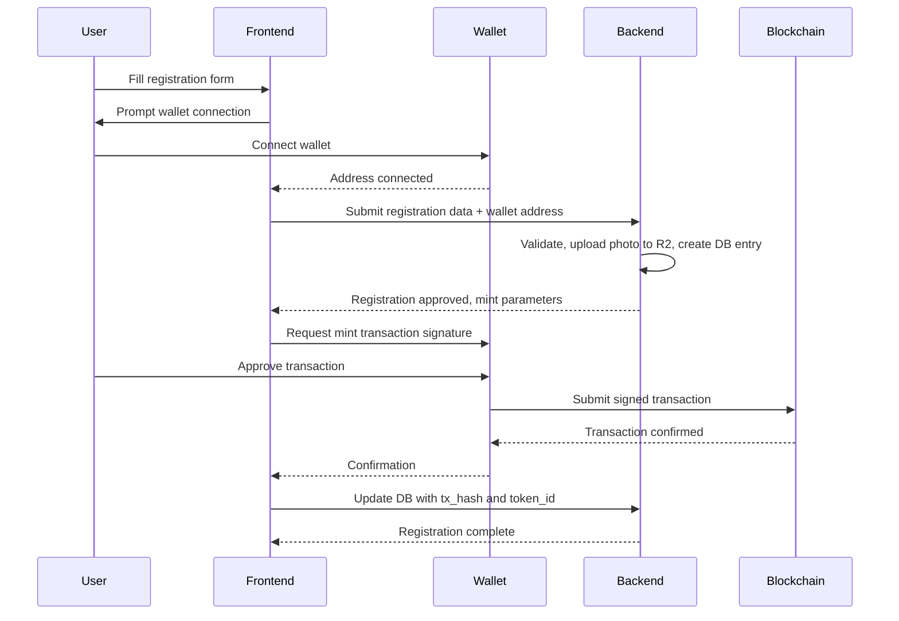
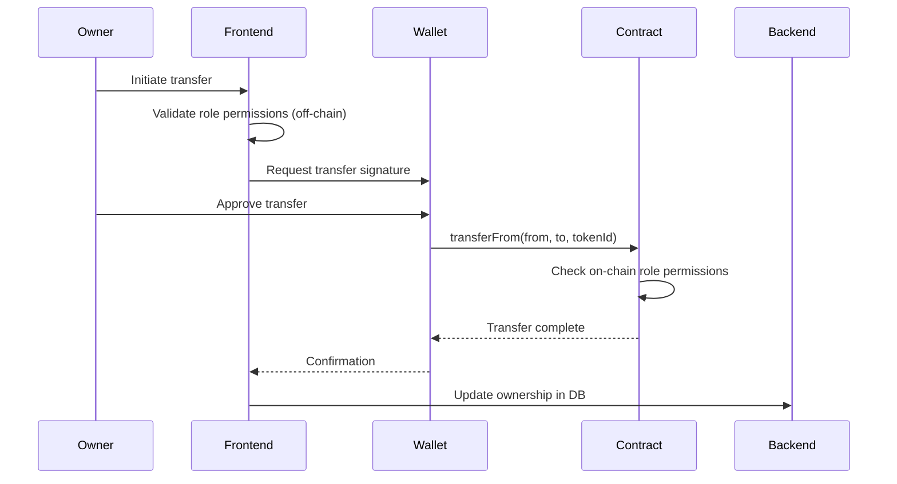
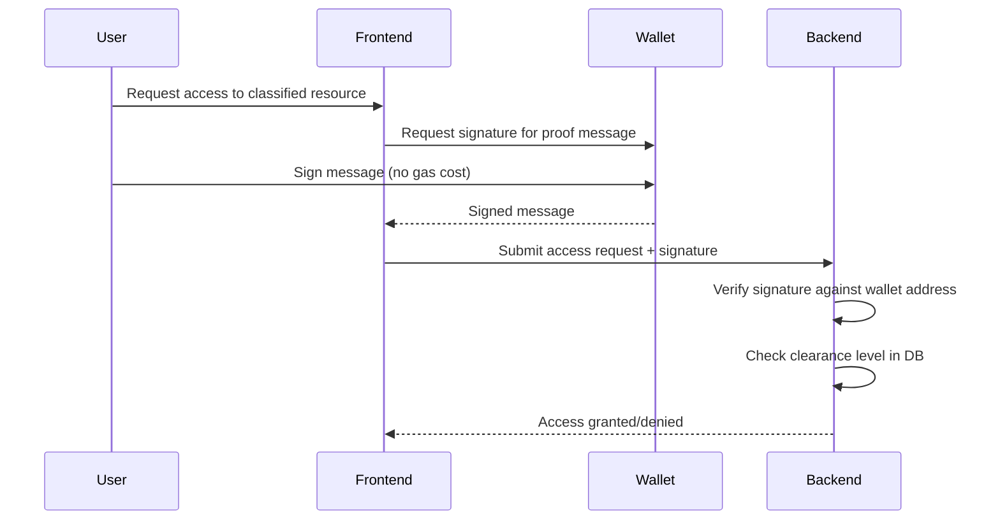

# Custody Model Documentation

## Decision: Self-Custodial (User-Controlled Wallets)

**Date:** September 17, 2026  
**Status:** ✅ IMPLEMENTED

---

## Summary

BEL Secure Platform uses a **self-custodial model** where users connect their own Web3 wallets (MetaMask, WalletConnect, Coinbase Wallet) to interact with blockchain features. The backend NEVER stores or manages user private keys.

---

## Rationale

### Why Self-Custodial?

1. **Alignment with Claims:** Platform documentation describes the system as "decentralized" and "self-sovereign identity" — this requires user key control.

2. **Security:** No single point of compromise. A breach of backend systems cannot expose user private keys.

3. **Regulatory Clarity:** Platform acts as a facilitator, not a custodian. Reduces regulatory burden and liability.

4. **Interoperability:** Users can interact with other Web3 systems using the same wallet/identity.

5. **Web3 Best Practices:** Industry-standard approach for decentralized applications.

### Why Not Managed Custody?

Managed custody (backend holds keys) would require:
- Secure key management infrastructure (HSM, multi-sig vaults)
- Significant regulatory compliance (depending on jurisdiction)
- User trust in platform security
- Contradicts "self-sovereign" and "decentralized" marketing
- Single point of failure

**Verdict:** Managed custody is inappropriate for a system claiming decentralization.

---

## Implementation

### Wallet Connection

**Supported Wallets:**
- MetaMask (injected provider)
- WalletConnect (mobile wallets, 300+ options)
- Coinbase Wallet

**Technology Stack:**
- `wagmi` v2.x - React hooks for Ethereum
- `viem` v2.x - TypeScript Ethereum library
- `@tanstack/react-query` - State management

**Configuration:** `src/lib/web3-config.ts`

### User Workflows

#### 1. Registration + Identity NFT Minting



**Key Points:**
- User signs the minting transaction with their wallet
- User pays gas fees from their wallet
- Backend never touches private keys

#### 2. Asset NFT Transfer



**Key Points:**
- On-chain role checks ensure authorization
- User controls when/how assets are transferred
- Backend syncs final state from blockchain

#### 3. Access Request Signing



**Key Points:**
- Off-chain message signing (EIP-712) for access proofs
- No gas costs for read operations
- Cryptographic proof of identity without revealing private key

---

## Backend Wallet (Admin Only)

### Purpose

The backend holds **ONE** admin wallet for:
- Smart contract deployment
- System-level operations (e.g., batch audit anchoring)
- Emergency admin functions (contract upgrades if proxy pattern used)

### What It Is NOT Used For

❌ Minting NFTs on behalf of users  
❌ Transferring user assets  
❌ Any user-facing transactions  

### Security Requirements

**Local Development:**
```env
ADMIN_WALLET_PRIVATE_KEY=0x...
```
⚠️ Use test wallet with no real funds

**Production:**

Option 1: **AWS KMS**
```env
AWS_KMS_KEY_ID=arn:aws:kms:us-east-1:123456789012:key/abc123
```

Option 2: **Azure Key Vault**
```env
AZURE_KEY_VAULT_URL=https://bel-secure-kv.vault.azure.net/
AZURE_KEY_NAME=admin-wallet-key
```

Option 3: **HashiCorp Vault**
```env
VAULT_ADDR=https://vault.example.com
VAULT_TOKEN=s.1234567890
VAULT_SECRET_PATH=secret/data/bel-secure/admin-wallet
```

**Key Rotation:** Every 90 days minimum

---

## User Education

### Onboarding Flow

1. **Wallet Installation**
   - Show MetaMask install link if not detected
   - Explain what a wallet is (simple terms)
   - Link to beginner resources

2. **Seed Phrase Backup**
   - CRITICAL: Emphasize importance of backup
   - "Write it down on paper, store securely"
   - "No one can recover this for you, including us"

3. **Gas Fees Explanation**
   - "You pay for your own transactions"
   - "This ensures the system is decentralized"
   - Show estimated costs for common operations

4. **Guardian Setup** (see B1)
   - Recommend 3-5 trusted guardians
   - Recovery mechanism if wallet is lost

### Support Documentation

Create these docs in `docs/user-guides/`:
- [ ] `01-wallet-setup.md`
- [ ] `02-connecting-wallet.md`
- [ ] `03-gas-fees-explained.md`
- [ ] `04-guardian-recovery.md`
- [ ] `05-security-best-practices.md`

---

## Tradeoffs & Mitigation

### Tradeoff 1: User Experience Complexity

**Issue:** Wallet setup is harder than username/password

**Mitigation:**
- Excellent onboarding flow with clear instructions
- Video tutorials
- Test mode with pre-funded wallets for exploration
- Support chat for wallet issues

### Tradeoff 2: Key Loss Risk

**Issue:** Lost seed phrase = lost identity (irreversible)

**Mitigation:**
- Guardian-based recovery (see B1 - Feature Request)
- Account abstraction exploration (social recovery)
- Redundant backup prompts during onboarding
- Warning banners until backup confirmed

### Tradeoff 3: Gas Costs

**Issue:** Users pay for every on-chain action

**Mitigation:**
- Deploy to L2 (Polygon/Optimism) for <$0.01 transactions
- Batch operations where possible
- Meta-transactions for subsidized critical operations
- Gas fee dashboard shows costs upfront

### Tradeoff 4: Browser Dependency

**Issue:** Wallet extensions primarily browser-based

**Mitigation:**
- WalletConnect support (mobile wallets via QR code)
- Mobile app roadmap with in-app browser
- Progressive web app (PWA) for mobile

---

## Testing Strategy

### Unit Tests

Test wallet connection states:
- ✅ Wallet not installed
- ✅ Wallet locked
- ✅ Wallet connected
- ✅ Wrong network selected
- ✅ Account changed
- ✅ Disconnected mid-session

### Integration Tests

Test transaction flows:
- ✅ Identity NFT minting (user signs)
- ✅ Asset transfer (owner signs)
- ✅ Role assignment (admin signs)
- ✅ Message signing (access proofs)

### E2E Tests

Use Playwright + MetaMask extension:
- ✅ Complete registration flow
- ✅ Asset management lifecycle
- ✅ Access request with signature
- ✅ Network switching behavior

---

## Monitoring & Observability

### Metrics to Track

- Wallet connection success rate
- Transaction failure rate by type
- Average gas costs per operation
- Wallet types distribution (MetaMask vs WalletConnect vs Coinbase)
- Time to complete wallet setup (onboarding funnel)

### Alerts

- Transaction failure spike (>5% of transactions)
- Gas price anomaly (>2x expected)
- RPC endpoint downtime
- Contract function revert rate increase

---

## Migration from Managed Custody (If Applicable)

**Current Status:** System was never in production with managed custody, so no migration needed.

If a migration were required:
1. Deploy new self-custodial contracts
2. Allow users to claim their existing identity by signing with new wallet
3. Burn old managed NFTs, mint new self-custodial NFTs
4. Grace period: 90 days for all users to migrate
5. Archive old system, destroy all private keys

---

## FAQs

**Q: Can I use the platform without a wallet?**  
A: No. The blockchain features require wallet signatures for security and decentralization.

**Q: What if I lose my wallet?**  
A: Use the guardian recovery system (Feature B1). Your designated guardians can help you regain access.

**Q: Why do I need to pay gas fees?**  
A: Gas fees pay for blockchain transaction processing. This is how decentralized networks operate. We recommend using L2 networks for lower costs (<$0.01 per transaction).

**Q: Can BEL Secure Platform access my wallet or funds?**  
A: No. We can only see your public wallet address. We cannot access your private keys or move your funds without your explicit signature approval.

**Q: Which wallet should I use?**  
A: MetaMask is the most popular and well-supported. For mobile, any WalletConnect-compatible wallet works.

---

## Related Documentation

- [ARCHITECTURE.md](../ARCHITECTURE.md) - Overall system architecture
- [docs/security/KEY_MANAGEMENT.md](security/KEY_MANAGEMENT.md) - Admin wallet security
- [docs/user-guides/](user-guides/) - End-user wallet guides
- Feature B1: Guardian Recovery System

---

**Approved By:** Platform Architecture Team  
**Implementation Lead:** [Your Name]  
**Review Date:** 2026-09-17
